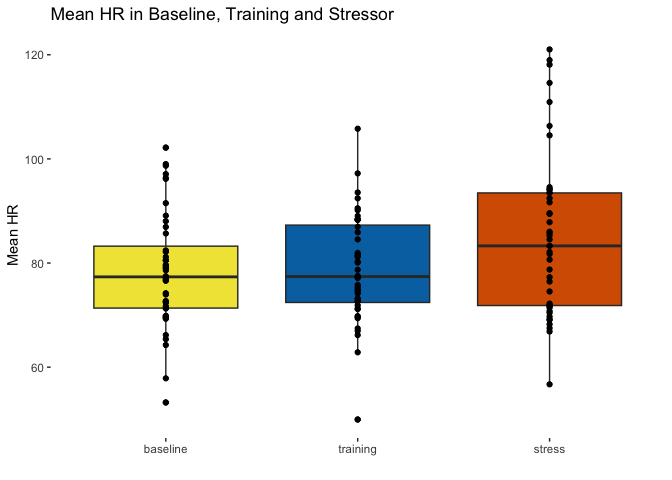
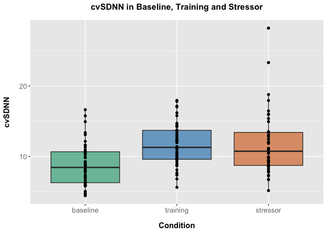
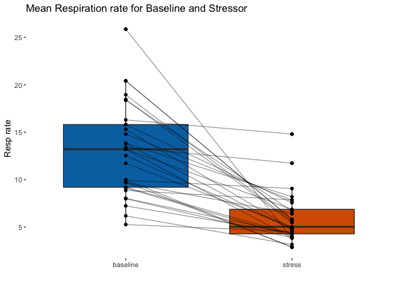
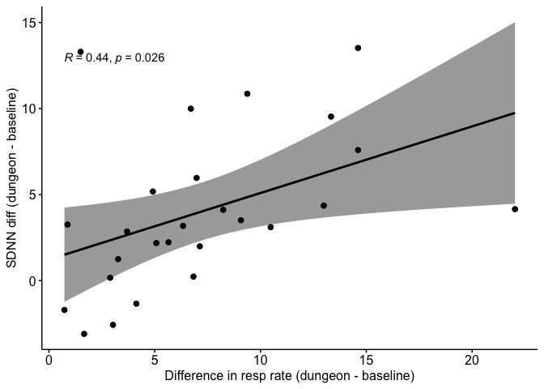
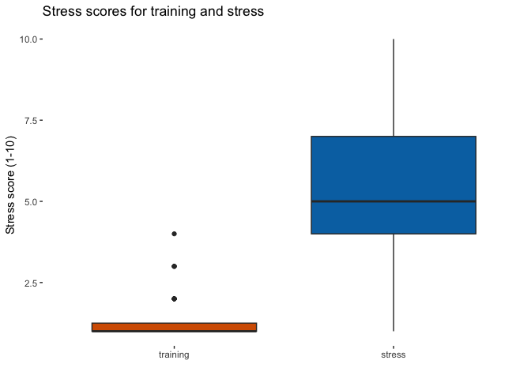
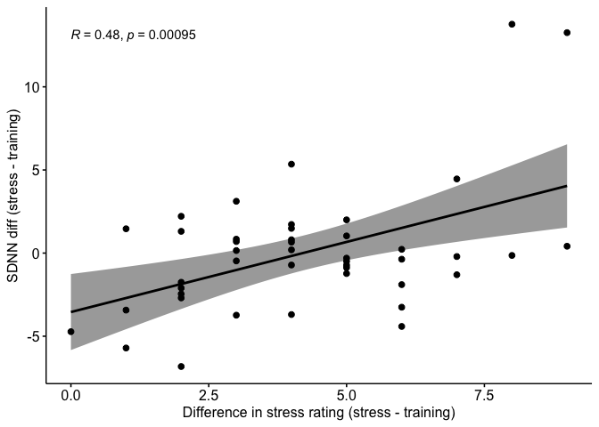
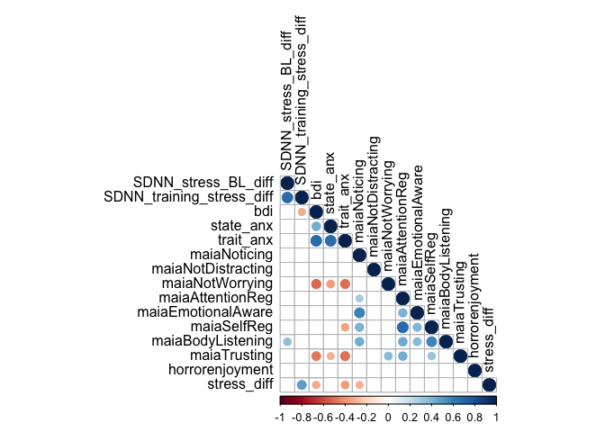
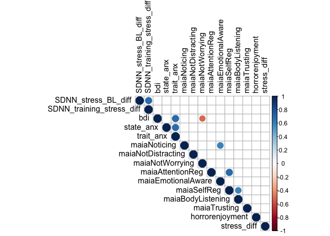
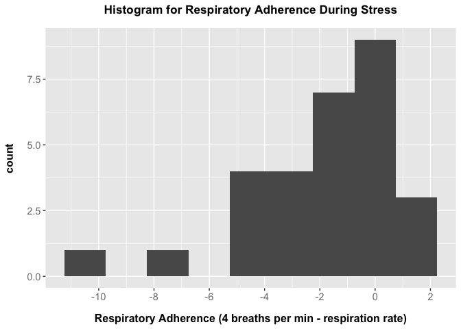
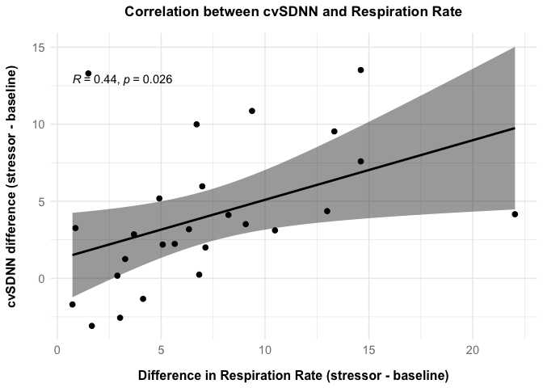

Biofeedback Proof of Concept Study
================
2023-09-19

# Background

This study provides a proof of concept of two virtual reality
mini-games, to both teach participants a physiological regulation
technique and subsequently to apply this technique in a stressful
biofefeedback environment.

### Study Design

Participants physiological measurements were taken at baseline (seated
at rest) as well as during the training (paced breathing training) and
stressor (biofeedback horror).

The physiological measurements reported here are Heart Rate (HR), heart
rate variability as indexed by SDNN, and respiration rate (resp).

Initial analysis was conducted using a paired t-test for the HR
difference from baseline to stressor, and Signs tests for the SDNN and
respiratory difference from baseline to stressor.

    ## 
    ##  Paired t-test
    ## 
    ## data:  HR$HR_baseline and HR$HR_stress
    ## t = -3.3451, df = 43, p-value = 0.001714
    ## alternative hypothesis: true mean difference is not equal to 0
    ## 95 percent confidence interval:
    ##  -10.531906  -2.609312
    ## sample estimates:
    ## mean difference 
    ##       -6.570609

    ## 
    ##  Dependent-samples Sign-Test
    ## 
    ## data:  SDNN$SDNN_baseline and SDNN$SDNN_stress
    ## S = 9, number of differences = 44, p-value = 0.000106
    ## alternative hypothesis: true median difference is not equal to 0
    ## 95.1 percent confidence interval:
    ##  -4.111754 -1.629125
    ## sample estimates:
    ## median of the differences 
    ##                  -2.57893

    ## 
    ##  Dependent-samples Sign-Test
    ## 
    ## data:  resp$resp_baseline and resp$resp_stress
    ## S = 29, number of differences = 29, p-value = 3.725e-09
    ## alternative hypothesis: true median difference is not equal to 0
    ## 97.6 percent confidence interval:
    ##  3.691027 9.072613
    ## sample estimates:
    ## median of the differences 
    ##                  6.707505

# Plots for Physiological change

<!-- --><!-- --><!-- -->

# Respiratory analysis

Correlation between the difference in respiration (stressor - baseline)
and the difference in SDNN (stressor - baseline)

    ## 
    ##  Pearson's product-moment correlation
    ## 
    ## data:  resp_cardio$resp_stress_bl_diff and resp_cardio$SDNN_stress_BL_diff
    ## t = 2.3725, df = 24, p-value = 0.02603
    ## alternative hypothesis: true correlation is not equal to 0
    ## 95 percent confidence interval:
    ##  0.05835787 0.70430180
    ## sample estimates:
    ##       cor 
    ## 0.4358572

<!-- -->

# Questionnaire results

Showing the difference in stress score between the training and stressor
sessions, as well as correlations between self-reported stress score and
SDNN

    ## 
    ##  Welch Two Sample t-test
    ## 
    ## data:  quest$boat_score and quest$dungeon_score
    ## t = -11.341, df = 78.019, p-value < 2.2e-16
    ## alternative hypothesis: true difference in means is not equal to 0
    ## 95 percent confidence interval:
    ##  -4.657785 -3.266744
    ## sample estimates:
    ## mean of x mean of y 
    ##  1.547170  5.509434

<!-- -->

    ## 
    ##  Pearson's product-moment correlation
    ## 
    ## data:  cardio_quest$stress_diff and cardio_quest$SDNN_training_stress_diff
    ## t = 3.5549, df = 42, p-value = 0.0009513
    ## alternative hypothesis: true correlation is not equal to 0
    ## 95 percent confidence interval:
    ##  0.2147043 0.6806305
    ## sample estimates:
    ##       cor 
    ## 0.4809295

<!-- -->

# Correlation matrices for SDNN

P-values unadjusted (top) and adjusted (bottom) for multiple comparisons

<!-- --><!-- -->

# Correlation matrices for Respiration

P-values unadjusted (top) and adjusted (bottom) for multiple comparisons

<!-- --><!-- -->
